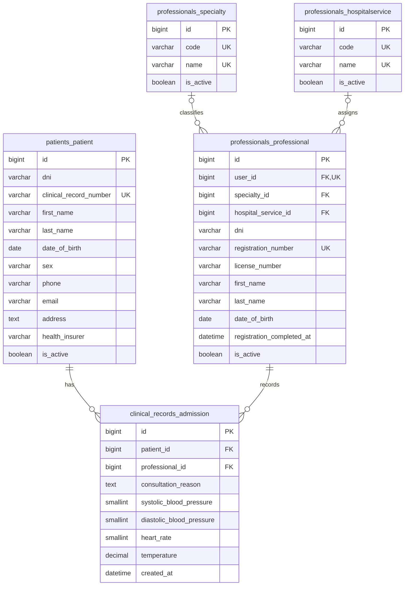

# HelixHealth

OpenHIS-UNLaM educational hospital information system built with Python 3.13,
Django 5.2 LTS, Django REST Framework, HTMX, Bootstrap 5, and PostgreSQL 18.

## Domain data model

The application currently has five domain tables. Django's authentication,
administration, session, and migration tables are omitted from this diagram.
`professionals_professional.user_id` references Django's `auth_user` table.



## Prerequisites

- Python 3.13
- [`uv`](https://docs.astral.sh/uv/) 0.12.5 or a compatible release
- Docker Desktop or Docker Engine with Docker Compose
- Git, when using the pre-commit hooks

## Fresh local setup

Clone the repository, open a terminal in its root, and create the local
environment file.

PowerShell:

```powershell
Copy-Item .env.example .env
```

Bash:

```bash
cp .env.example .env
```

Replace the placeholder `DB_PASSWORD` in `.env` before starting PostgreSQL for
the first time. PostgreSQL applies that initialization password only when the
`postgres_data` volume is empty; changing `.env` later does not change the
password stored by an existing database cluster.

Install the exact locked Python environment and the browser used by the smoke
tests:

```text
uv sync --frozen
uv run playwright install chromium
```

Validate the Compose configuration, start PostgreSQL, and wait for its health
check:

```text
docker compose config
docker compose up -d --wait db
```

Apply every Django migration and run the system checks:

```text
uv run python manage.py migrate --noinput
uv run python manage.py check
```

`manage.py` uses the development environment and loads `.env`. When commands
run on the host, the database host defaults to `localhost`; the Compose `web`
service uses the internal hostname `db`.

Start the development server and open <http://localhost:8000>:

```text
uv run python manage.py runserver
```

## Seed data

Seed data is versioned as reversible Django data migrations. Running
`migrate` inserts the administrative and medical-professional role groups plus
the initial specialties and hospital services. No separate seed command is
required.

Apply any pending seed migrations:

```text
uv run python manage.py migrate --noinput
```

Confirm the reference records are available:

```text
uv run python manage.py shell -c "from professionals.models import HospitalService, Specialty; print('specialties:', Specialty.objects.count()); print('hospital services:', HospitalService.objects.count())"
```

A fresh database should report six specialties and five hospital services.

## Run with the application container

To run both Django and PostgreSQL through Compose:

```text
docker compose build
docker compose up -d --wait db
docker compose run --rm web python manage.py migrate --noinput
docker compose up web
```

Open <http://localhost:8000>. Press `Ctrl+C` to stop the foreground web
service.

## Production container

The image starts Gunicorn and collects versioned static assets at container
startup. Configure every production value outside the image; the application
will refuse to start without a secret key, database settings, and allowed
hosts. For a deployment behind TLS termination, set the public host names and
keep the secure defaults enabled:

```text
DJANGO_ENVIRONMENT=production
DJANGO_SECRET_KEY=<a long random value>
DJANGO_ALLOWED_HOSTS=helixhealth.example.org
DB_NAME=helixhealth
DB_USER=helixhealth_app
DB_PASSWORD=<database password>
DB_HOST=<database hostname>
DB_PORT=5432
```

`DJANGO_SECURE_SSL_REDIRECT` defaults to `true` in production. Set it to
`false` only for a trusted local HTTP probe; production traffic should reach
the application through HTTPS. Static assets are served from `/static/` by
WhiteNoise. Before releasing an image, run:

```text
docker compose -f compose.yaml -f compose.production.yaml build web
docker compose -f compose.yaml -f compose.production.yaml run --rm web python manage.py check --deploy --fail-level WARNING
```

`compose.yaml` remains a development stack: it bind-mounts the working tree and
runs Django's autoreloading development server. Use the production override
when running the Gunicorn image without a source bind mount. Start the database
and apply pending migrations before starting the web service:

```text
docker compose -f compose.yaml -f compose.production.yaml up -d --wait db
docker compose -f compose.yaml -f compose.production.yaml run --rm web python manage.py migrate --noinput
docker compose -f compose.yaml -f compose.production.yaml up -d --wait web
```

If a trusted reverse proxy terminates TLS and forwards requests over HTTP, set
`DJANGO_TRUST_X_FORWARDED_PROTO=true` only when that proxy strips any incoming
`X-Forwarded-Proto` header and replaces it with its own value. This enables
Django's proxy SSL header and prevents redirect loops; do not enable it when
clients can reach the application directly.

## Using the application

Start at `/` and choose **Sign in** or **Open your workspace**. Administrative
users reach **Patient search**; medical professionals reach **Clinical workspace**.
The public landing page shows no patient information.

Both workspaces list active patients, 20 per page. Type part of a first name,
surname, or full name into **Name or surname** to filter the list automatically.
Full names work in either order, and matching ignores letter case. Clear the
field to show all active patients again. **Next** and **Previous** retain the
current filter. If JavaScript is unavailable, use **Search names** to submit the
same search. The separate **DNI** field still performs an exact lookup.

Open a patient's record to review details or, in the clinical workspace, choose
**Record admission**. Administrative users can create a patient with **New patient**
and edit existing records. These screens also support narrow mobile layouts.

## Tests

Start PostgreSQL before running the test suite. Tests use PostgreSQL, never
SQLite.

```text
docker compose up -d --wait db
uv run pytest
```

Run only the non-browser tests when Chromium is not installed:

```text
uv run pytest -m "not browser"
```

## Quality checks

Run the same formatting, linting, and type checks enforced by CI:

```text
uv run ruff format --check .
uv run ruff check .
uv run mypy
```

Run every configured pre-commit hook manually:

```text
uv run pre-commit run --all-files
```

Install the hooks into the current Git checkout if desired:

```text
uv run pre-commit install
```

## Database and container lifecycle

Inspect service health or PostgreSQL logs:

```text
docker compose ps
docker compose logs db
```

Stop services while preserving the PostgreSQL volume:

```text
docker compose down
```

Permanently delete the local database and its contents only when an intentional
reset is required:

```text
docker compose down --volumes
```

After a reset, the next `docker compose up -d --wait db` initializes a new
database using the current values in `.env`.
